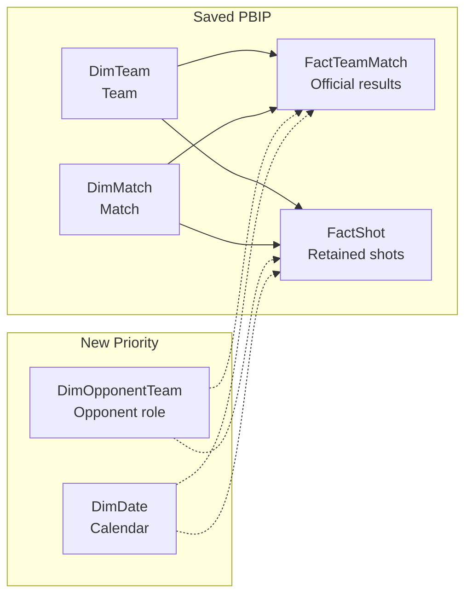

# Euro 2024 scoring in Power BI

**This project follows one soccer tournament from the big picture down to the events behind each result.**

```text
Tournament
└── Team
    └── Matches
        ├── Shots
        └── Goals
```

The original goal was to begin with a tournament-wide team comparison, then narrow to one team, one match, and the shots and goals behind that result.

**The saved project currently proves the tournament-to-team foundation.** It contains four model tables, four relationships, seven DAX measures, and one report page. The remaining team, match, shot, and goal drilldowns are next stages rather than claimed features.

**The report stopped at one page for a practical reason.** Late VM input problems made further report editing unreliable, so I focused on preserving the working model, its analytical rules, and a clear next path.

Acknowledge: [Issue #13: bug: Report Fetches from FactShot but with no Relationship to FactTeamMatch](https://github.com/dckallos/statsbomb-sandbox/issues/13)

## Contents

- [Current report page and result](#current-report-page-and-result)
  - [Question the page answers](#question-the-page-answers)
  - [What the result does not prove](#what-the-result-does-not-prove)
- [Euro 2024 data and scoring rules](#euro-2024-data-and-scoring-rules)
  - [Pinned source and tournament snapshot](#pinned-source-and-tournament-snapshot)
  - [Expected goals and shot boundary](#expected-goals-and-shot-boundary)
  - [Why official goals differ](#why-official-goals-differ)
- [Saved Power BI semantic model](#saved-power-bi-semantic-model)
  - [Four tables and their grains](#four-tables-and-their-grains)
  - [Relationships and seven saved measures](#relationships-and-seven-saved-measures)
- [Model enhancements and delivery roadmap](#model-enhancements-and-delivery-roadmap)
  - [New Priority model additions](#new-priority-model-additions)
  - [Why a stronger model matters](#why-a-stronger-model-matters)
  - [One additional day for validation](#one-additional-day-for-validation)
  - [Three additional days for team analysis](#three-additional-days-for-team-analysis)
  - [One additional week for match and shot analysis](#one-additional-week-for-match-and-shot-analysis)
  - [Saved boundary and PBIP evidence](#saved-boundary-and-pbip-evidence)

## Current report page and result

### Question the page answers

**The current page answers the first tournament-wide question.** It asks

> Which teams scored more or fewer goals per match than expected from the shots they took?

**All 24 teams appear.** Twelve scored above their expected rate and twelve scored below it. Spain has the largest displayed positive gap at `+0.63` goals per match. Croatia has the largest negative gap at `-0.94`.

### What the result does not prove

**The result is descriptive.** It does not prove finishing skill, luck, or future performance.

## Euro 2024 data and scoring rules

### Pinned source and tournament snapshot

**The data contract keeps official results and shot evidence separate.**

- **Source**  StatsBomb Open Data
- **Revision**  `b0bc9f22dd77c206ddedc1d742893b3bbe64baec`
- **Competition ID**  `55`
- **Season ID**  `282`

**The snapshot contains 51 matches and 1,340 Shot events.** The model retains 1,316 shots after removing 24 period-five shootout attempts.

**Raw event files are not committed here.** Source configuration, profiling, transformations, and reconciliation evidence are retained instead.

### Expected goals and shot boundary

**Expected goals estimates the chance that a shot becomes a goal.** Extra-time shots and ordinary penalties remain.

### Why official goals differ

**Official goals come from the match catalog while expected goals comes from Shot events.** The catalog records 117 goals while 107 retained Shot outcomes are named Goal. Ten credited own goals explain the difference.

## Saved Power BI semantic model

### Four tables and their grains

**The model uses shared Team and Match dimensions to keep two facts at their proper grains.**

| Table | Grain |
|---|---|
| `DimTeam` | one row per team |
| `DimMatch` | one row per match |
| `FactTeamMatch` | one row per team and match |
| `FactShot` | one row per retained shot |

### Relationships and seven saved measures

**`DimTeam` and `DimMatch` filter both facts through active one-to-many single-direction relationships.** There is no fact-to-fact or bidirectional relationship.

**The seven saved measures cover the current question.** They calculate matches, official goals, expected goals, per-match rates, and the signed difference used by the report.

## Model enhancements and delivery roadmap

### New Priority model additions

**The current facts can support more analysis without being joined together.** Solid lines are saved PBIP relationships. Dotted lines show the New Priority.



**The New Priority preserves both fact grains.** `DimOpponentTeam` adds role-aware comparison. `DimDate` adds calendar filtering. Metadata makes the field list easier to use.

### Why a stronger model matters

**A stronger semantic model lets new report pages reuse the same definitions instead of rebuilding logic.**

| Enhancement | Added value |
|---|---|
| Model metadata | clearer fields and fewer accidental key selections |
| Opponent Team role | selected-team and opponent comparisons through active filters |
| Date dimension | consistent date filtering and sorting |
| Reusable measures | one definition across tournament, team, and match pages |
| Validation rules | trusted refreshes and visible failures |

### One additional day for validation

- Refresh and reconcile known totals
- Recheck four relationships and seven measures
- Save, reopen, and retest
- Add the source and expected-goals note

### Three additional days for team analysis

- Finish model descriptions
- Hide technical fields
- Build the `Team → Matches` path
- Validate filters and totals

### One additional week for match and shot analysis

- Finish the selected-team view
- Build the `Match → Shots and Goals` path
- Test extra time, own goals, and shootout exclusions
- Add Date or Opponent Team roles only if needed

### Saved boundary and PBIP evidence

**Broader sidecars describe later work.** Objects absent from the saved PBIP are not claimed as implemented.

**The baselined PBIP model is available for technical inspection.** See the [saved semantic model](power-bi/Euro2024.SemanticModel/definition/).

Data source is StatsBomb Open Data.
